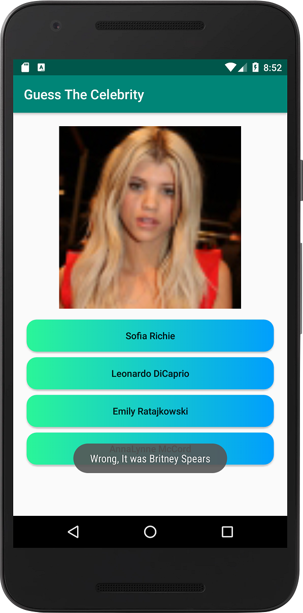

# GuessTheCelebrity
A Quiz to test your knowledge of famous celebrities.

# What's in this project?
- In this project I parse a webpage to extract all the needed data using <b>regex pattern matching</b>. The class <b>WebParser</b> contains two methods <code>extractImages(String)</code> and <code>extractCelebrities(String)</code> that takes the html code as input and returns a list of images/celebrities.

- the html code for the celebrities data is obtained from <a href="http://www.posh24.se/kandisar">here</a>. The html is downloaded using a method <code>getUrlBytes()</code> from the class <b>NetworkUtils</b>
This method using an <code>HttpURLConnection</code> object to make a connection and returns a stream of data. Other third party libraries like <code>OkHttp</code> & <code>Retrofit</code> maybe used as well, however i'm only using java.net and java.io packages for that.

- I use AsyncTasks to run 2 background tasks for downloading. The first task <code>WebDownloader</code> is for downloading the html code as mentione before, and the second task <code>ImageDownloader</code> is to return a bitmap corresponding to a certain celebrity. Then an <code>LruCache</code> class from the support library to cache these bitmaps. 

- <b>Fragments</b> are also used in this simple project to make use of <code>setRetainInstance(true)</code> which will retain our data (LruCache and answers) across configuration changes such as screen orientation.

- A landscape variation is also added for the default layout.

# Screenshots
        
 

